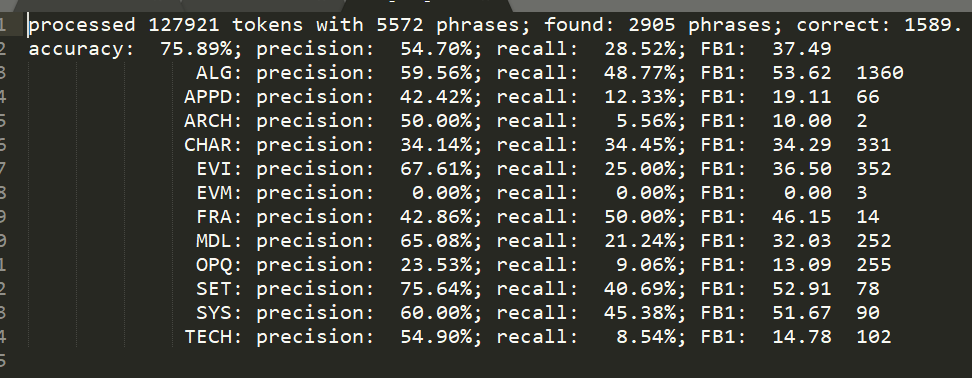

# CNKI摘要数据构造NER数据集

## 抓取CNKI摘要

[爬虫仓库](https://github.com/lvyufeng/cnki_paper_crawler)


## 旧的自建数据集的一些预处理
由于之前做过数据集标注，虽然有很多错误，而且新定义了类型和规则，但是之前的数据处理后也可以使用。以下为处理步骤

1. 把BIO表示重新处理为JSON
    ```
    {
        'entity':'长短时记忆网络',
        'text':'针对现有基于视频整体序列结构建模的行为识别方法中,存在的大量时空背景混杂信息,而引起的行为表达的判决能力低,行为类别错误判定的问题,提出一种基于双流特征的时空关注度长短时记忆网络模型。'
        'begin':82,
        'end':88,
    }
    ```
1. 归类实体，剔除不需要的类型
    1. 旧的类型包括：
        <!-- |  表头   | 表头  |
        |  ----  | ----  |
        | 单元格  | 单元格 |
        | 单元格  | 单元格 | -->

        |类型|描述|实体数量|
        |----|----|----|
        | ALG|    算法|        6855 |
        | APPD|   应用领域|    1064 |
        | ARCH|   架构/结构|   247 |
        | CHAR|   特征/特性|   2297 |
        | EVI|    评价指标 |   2805 |
        | EVM|    评价方法 |   142 |
        | FRA|    框架    |    255 |
        | MDL|    模型    |    3100 |
        | OPQ|    开放问题 |   2260 |
        | SET|    数据集   |   616 |
        | SYS|    系统     |   876 |
        | TECH|   技术     |   1879 |
        \
        使用基本的Bi-LSTM+CRF跑出的效果如下:
        
    1. 新的实体类型定义如下：
        |大类|子类|嵌套类|
        |----|----|----|
        |MTH (Method)|MTH.ALG (Algorithm)|MTH.NEST (Nested Method)|
        ||MTH.MDL (Model)||
        ||MTH.TECH (Technology)||
        ||MTH.SYS (System)||
        |TASK|TASK.AREA (Area)|TASK.NEST|
        ||TASK.QUES (Question)||
        ||TASK.REASON (Reason)||
        |DATA|DATA.SET (Dataset)|DATA.NEST|
        ||DATA.SRC (Data sources)||

1. 重新标注实体

    1. 采用[SemEval 2017 Task 10](https://scienceie.github.io/)的标注规则:

        - 不标注复杂的实体,如“***基于长短期记忆神经网络的时序模型***”,该实体作为MTH.NEST,其中“***长短期记忆神经网络***”是一个实体,“***时序模型***”是一个实体,二者构成复杂的嵌套实体。
        
        - 具有同指关系的实体，如“***命名实体识别(Named Entity Recognition),缩写为NER***”中,**命名实体识别**、**NER**、**Named Entity Recognition**为同一个实体的不同表述，且有中英文表示的明显区别,需要单独标注为**TASK-CH**、**TASK.SHORT**、**TASK.EN**。
        
        - 所用使用并列关系词连接的，标注为同级别实体。如:“***XXX和YYY***”，XXX、YYY应该为同一实体类型。